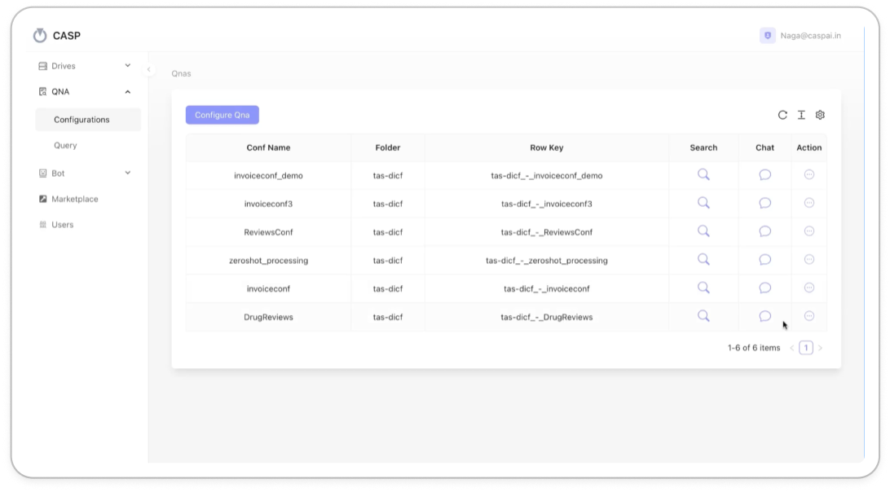

Here's an updated Markdown documentation outline, covering the additional features for **Chat Configurations** with **OpenAI's ChatGPT**, **Google Gemini**, and **CASP’s fine-tuning capabilities**. This documentation also includes information on available open-source models and specialized Deepsek models. I have added sections for each feature and included placeholders for screenshots.

---

# LLM Chat System Configuration

<video controls autoplay loop muted width="100%">
    <source src="../images/Bot/FileInsight.mp4" type="video/mp4">
    Your browser does not support the video tag.
</video>

This documentation provides a detailed guide on configuring the **Chat System** in Drive Insights, covering model selection (ChatGPT, Google Gemini, and other open-source models), fine-tuning options, and integration with Deepsek models.

---

## Table of Contents

1. [Introduction](#introduction)
2. [Chat Configuration Setup](#chat-configuration-setup)
    - [Selecting a Model](#selecting-a-model)
    - [Configuring OpenAI ChatGPT](#configuring-openai-chatgpt)
    - [Configuring Google Gemini](#configuring-google-gemini)
3. [Fine-Tuning Models](#fine-tuning-models)
4. [Dashboard Overview](#dashboard-overview)
5. [Sample Screenshots](#sample-screenshots)

---

## 1. Introduction

The **Drive Insights Chat System** enables users to set up chat configurations with multiple model options, including **OpenAI’s ChatGPT**, **Google Gemini**, and other open-source models. Additionally, users can fine-tune these models to suit specific needs, leveraging CASP’s comprehensive configuration options and integration with specialized Deepsek models.

---

## 2. Chat Configuration Setup

### Selecting a Model

To start setting up a chat configuration:

1. Navigate to the **QNA** section from the sidebar.
2. Click **Configure QnA** to create a new configuration.
3. Select the model of your choice from the list: **OpenAI’s ChatGPT**, **Google Gemini**, or **other open-source models**.
4. Save your selection.

---

### Configuring OpenAI ChatGPT

The following steps outline how to configure OpenAI’s ChatGPT for use in the CASP Chat System:

1. In **Chat Configurations**, select **OpenAI ChatGPT** from the list.
2. Set specific parameters such as **temperature**, **top-k sampling**, and **max tokens** to control the response generation behavior.
3. Customize additional settings to align ChatGPT responses with your requirements.
4. Save the configuration to apply it.

---

### Configuring Google Gemini

The steps to configure **Google Gemini** are as follows:

1. Under **Chat Configurations**, select **Google Gemini**.
2. Define settings such as **response length**, **specific language options**, and **model version**.
3. Adjust additional options available to optimize the interaction with the Google Gemini model.
4. Save your configuration.

---

## 3. Fine-Tuning Models

CASP provides the option to fine-tune all supported models, including ChatGPT, Google Gemini, and open-source models. Fine-tuning enables customization of these models based on your unique data and requirements.

1. Go to **Fine-Tuning** under the Chat section.
2. Select the model you wish to fine-tune.
3. Upload your dataset and specify parameters like **epochs**, **learning rate**, and **batch size**.
4. Initiate the fine-tuning process, and monitor the progress through the dashboard.
5. Save the fine-tuned model configuration for future interactions.

---

## 4. Dashboard Overview

The dashboard provides insights into the performance of different chat configurations, including details on interaction logs, model accuracy, and response times.

1. Navigate to the **Dashboard** to access performance metrics for the configured models.
2. Select a chat configuration to view metrics such as **Response Time**, **Model Accuracy**, and **Usage Logs**.
3. Visualize trends and analyze model behavior to optimize configurations.

<!--  -->

---

## 5. Sample Screenshots

1. **Chat Configuration Setup**  
   

2. **OpenAI ChatGPT Configuration**  
   
3. **Google Gemini Configuration**  
   
4. **Fine-Tuning Models**  
   

5. **Dashboard with Chat Metrics**  
   

---

### End of Documentation

---

To complete this documentation, replace placeholders like `./images/chat_configuration_setup.png` with the actual paths to the screenshots you have. This format ensures comprehensive guidance for setting up and fine-tuning chat models in the Drive Insights platform.